# Universal Coupon Extraction - Simplified Control Flow V2

## Production-Ready Architecture with Sealed Results & Feature Flags

```mermaid
flowchart TD
    START[User Input] --> INPUT{Input Method}
    INPUT -->|Camera/Gallery/Share| URI[Image URI]
    INPUT -->|Manual Entry| MANUAL[Manual Form]
    
    URI --> PERSIST[UriPersistenceManager]
    PERSIST -->|App-Private Storage| PERSISTED_URI[Persisted URI]
    
    PERSISTED_URI --> LOAD_BITMAP[Load Bitmap]
    LOAD_BITMAP --> BITMAP_MGR[BitmapManager]
    BITMAP_MGR -->|Enforce Pixel Budget 3×768²| PREPROCESSED[Preprocessed Bitmap]
    
    %% Stage 1: Detection
    PREPROCESSED --> DETECT[Stage 1: Detect Coupons]
    DETECT -->|TwoStageDetector + Validator| COUPON_ROIS[List&lt;CouponROI&gt;]
    
    %% Stage 2: Per-Coupon Extraction (Unified Pipeline)
    COUPON_ROIS --> FOR_EACH[For Each Coupon ROI]
    FOR_EACH --> PRIMARY_PIPELINE{Primary Pipeline<br/>Feature Flag}
    
    %% LLM-First Path
    PRIMARY_PIPELINE -->|LLM_FIRST| LLM_LOCATE[1. LLM Locates Field ROIs]
    LLM_LOCATE -->|MiniCPM Tile Processing<br/>Timeout: 2s| FIELD_ROIS_LLM[Field ROIs + Semantic Labels]
    
    %% OCR-First Path
    PRIMARY_PIPELINE -->|OCR_FIRST| OCR_LOCATE[1. OCR Finds Text Regions]
    OCR_LOCATE -->|ML Kit + Keyword Sniff<br/>Timeout: 1s| FIELD_ROIS_OCR[Field ROIs + Text Spans]
    
    %% Hybrid Path
    PRIMARY_PIPELINE -->|HYBRID| PARALLEL[1. Parallel: LLM + OCR]
    PARALLEL --> LLM_LOCATE
    PARALLEL --> OCR_LOCATE
    
    %% Common path: Extract text from ROIs
    FIELD_ROIS_LLM --> EXTRACT_TEXT[2. OCR Extract Text from ROIs]
    FIELD_ROIS_OCR --> EXTRACT_TEXT
    
    EXTRACT_TEXT -->|ML Kit on ROI Batch<br/>Timeout: 1s| OCR_RESULTS[OCR Results per ROI]
    
    OCR_RESULTS --> AMBIGUOUS_CHECK{Low Confidence<br/>ROIs?}
    AMBIGUOUS_CHECK -->|Yes| LLM_ASSIST[3. LLM Read-Assist]
    LLM_ASSIST -->|Cropped Tiles Only<br/>Timeout: 2s| LLM_ASSIST_RESULTS[LLM Assist Results]
    LLM_ASSIST_RESULTS --> FUSE_FIELDS
    
    AMBIGUOUS_CHECK -->|No| FUSE_FIELDS[4. Fuse Fields]
    
    %% Field Fusion (Per-Field)
    FUSE_FIELDS --> FUSE_CODE[Fuse: Code]
    FUSE_FIELDS --> FUSE_EXPIRY[Fuse: Expiry]
    FUSE_FIELDS --> FUSE_CASHBACK[Fuse: Cashback]
    FUSE_FIELDS --> FUSE_STORE[Fuse: Store]
    
    FUSE_CODE -->|Universal Validator<br/>Edit Distance ≤2<br/>Threshold: 0.85| CODE_CANDIDATE[Code Candidate + Confidence]
    FUSE_EXPIRY -->|Indian Date Parser<br/>IST-First<br/>Threshold: 0.70| EXPIRY_CANDIDATE[Expiry Candidate + Confidence]
    FUSE_CASHBACK -->|Currency Parser<br/>₹, %, Thousands<br/>Threshold: 0.75| CASHBACK_CANDIDATE[Cashback Candidate + Confidence]
    FUSE_STORE -->|Brand Detection<br/>Threshold: 0.60| STORE_CANDIDATE[Store Candidate + Confidence]
    
    CODE_CANDIDATE --> BUILD_INFO[Build CouponInfo]
    EXPIRY_CANDIDATE --> BUILD_INFO
    CASHBACK_CANDIDATE --> BUILD_INFO
    STORE_CANDIDATE --> BUILD_INFO
    
    %% Policy Decision
    BUILD_INFO --> POLICY_DECISION{5. Policy Decision}
    
    POLICY_DECISION -->|code ≥0.85 AND<br/>expiry ≥0.70 OR cashback ≥0.75| GOOD[ExtractionResult.Good]
    POLICY_DECISION -->|Has minimal info<br/>but below threshold| LOW_QUALITY[ExtractionResult.LowQuality]
    POLICY_DECISION -->|Missing critical fields| FAILED[ExtractionResult.Failed]
    
    %% Timeout/Error Fallback
    PRIMARY_PIPELINE -->|Timeout > 6s| FALLBACK_TRIGGER
    EXTRACT_TEXT -->|Error| FALLBACK_TRIGGER
    FUSE_FIELDS -->|Error| FALLBACK_TRIGGER
    
    FALLBACK_TRIGGER[Global Timeout/Error Handler] --> TRADITIONAL_OCR[Traditional OCR Fallback]
    TRADITIONAL_OCR -->|Regex Pattern Matching<br/>Timeout: 1s| BASIC_RESULT[Basic Extraction]
    BASIC_RESULT --> FALLBACK_RESULT[ExtractionResult.LowQuality]
    
    %% Results Handling
    GOOD --> LOG_RUNPATH[Log RunPath + Signals]
    LOW_QUALITY --> LOG_RUNPATH
    FAILED --> LOG_RUNPATH
    FALLBACK_RESULT --> LOG_RUNPATH
    
    LOG_RUNPATH --> PERSIST_RESULT[Persist to extraction_feedback_v1]
    
    %% UI Flow
    GOOD --> FEEDBACK_CHECK{Show Feedback<br/>Dialog?}
    FEEDBACK_CHECK -->|Universal Method| FEEDBACK_DIALOG[ExtractionFeedbackDialog]
    FEEDBACK_DIALOG -->|Confirmed| LEARN_SUCCESS[Learn from Success]
    FEEDBACK_DIALOG -->|Corrected| LEARN_CORRECTION[Learn from Correction]
    
    LEARN_SUCCESS --> PATTERN_TABLE[(Room: learned_patterns_v1)]
    LEARN_CORRECTION --> PATTERN_TABLE
    
    LEARN_SUCCESS --> FEEDBACK_TABLE[(Room: extraction_feedback_v1)]
    LEARN_CORRECTION --> FEEDBACK_TABLE
    
    FEEDBACK_CHECK -->|No| NAVIGATE_FORM
    GOOD --> NAVIGATE_FORM[Navigate to CouponFormScreen]
    LOW_QUALITY --> NEEDS_REVIEW[Show Needs Review UI]
    
    NEEDS_REVIEW --> REVIEW_DIALOG[Review Dialog with Confidence Chips]
    REVIEW_DIALOG -->|User Edits| NAVIGATE_FORM
    
    %% Form & Save
    NAVIGATE_FORM --> FORM[CouponFormScreen]
    MANUAL --> FORM
    
    FORM -->|User Saves| VALIDATE[Validate Form]
    VALIDATE --> DEDUP_CHECK{Check Duplicate<br/>Hash?}
    
    DEDUP_CHECK -->|Hash: store+code+expiry+pHash| HASH_LOOKUP[Query by Hash]
    HASH_LOOKUP -->|Not Found| INSERT[Room Insert]
    HASH_LOOKUP -->|Found| SKIP_DUPLICATE[Skip Duplicate]
    
    INSERT --> COUPON_TABLE[(Room: coupons)]
    
    %% Home Screen Display
    COUPON_TABLE -->|Query + Filter + Sort| HOME_VM[HomeViewModel]
    HOME_VM -->|Case-Insensitive| FILTERED[Filtered List]
    FILTERED --> HOME_SCREEN[HomeScreen]
    
    HOME_SCREEN --> ENHANCED_CARD[EnhancedCouponCard]
    ENHANCED_CARD --> CARD_DISPLAY[Card UI]
    
    CARD_DISPLAY -->|getCashbackDisplayText| TYPED_DISPLAY{Cashback Type}
    TYPED_DISPLAY -->|PERCENT| PERCENT["75% OFF"]
    TYPED_DISPLAY -->|AMOUNT| AMOUNT["₹500"]
    TYPED_DISPLAY -->|TEXT| TEXT["Free Delivery"]
    
    ENHANCED_CARD -->|Click| DETAIL[CouponDetailScreen]
    
    %% Performance Monitoring
    PERSIST_RESULT --> PERF_MONITOR[ExtractionPerformanceMonitor]
    PERF_MONITOR --> RECORD_METRICS[Record Metrics]
    
    RECORD_METRICS --> SESSION_STATS[In-Memory SessionStats]
    SESSION_STATS -->|Persist on Read/Every 10th| DAILY_STATS[(SharedPrefs: daily_stats)]
    
    %% Dashboard
    DAILY_STATS --> DASHBOARD_VM[ExtractionDashboardViewModel]
    DASHBOARD_VM -->|Force Persist First| REFRESH_DASHBOARD[Refresh Dashboard]
    
    REFRESH_DASHBOARD --> CALC_OVERALL[Calculate SystemPerformance]
    CALC_OVERALL --> METHOD_BREAKDOWN[Method Breakdown]
    CALC_OVERALL --> LEARNING_PROGRESS[Learning Progress]
    CALC_OVERALL --> TRENDS[Recent Trends]
    
    METHOD_BREAKDOWN --> SYS_PERF[SystemPerformance Object]
    LEARNING_PROGRESS --> SYS_PERF
    TRENDS --> SYS_PERF
    
    SYS_PERF --> DASHBOARD_UI[ExtractionDashboardScreen]
    
    DASHBOARD_UI --> METRICS_DISPLAY[Metrics Display]
    METRICS_DISPLAY -->|E2E Time p50/p95| PERF_CHART[Performance Chart]
    METRICS_DISPLAY -->|Field F1 Scores| FIELD_CHART[Field Accuracy Chart]
    METRICS_DISPLAY -->|Path Breakdown| PATH_CHART[Method Usage Chart]
    METRICS_DISPLAY -->|Disagreement Rate| DISAGREE_CHART[LLM vs OCR Chart]
    
    DASHBOARD_UI --> OPT_CONTROLS[Optimization Controls]
    OPT_CONTROLS -->|Cleanup| CLEANUP[Remove Old Stats]
    OPT_CONTROLS -->|Optimize| OPTIMIZE[Recalibrate Patterns]
    
    OPTIMIZE --> PATTERN_TABLE
    
    %% Observability
    LOG_RUNPATH --> OBSERVABILITY[(Observability Metrics)]
    OBSERVABILITY --> METRIC_E2E_TIME[E2E Time by Device]
    OBSERVABILITY --> METRIC_PATH_BREAKDOWN[Path Usage %]
    OBSERVABILITY --> METRIC_FIELD_F1[Field-Level F1]
    OBSERVABILITY --> METRIC_DISAGREEMENT[LLM vs OCR Disagreement]
    OBSERVABILITY --> METRIC_REVIEW_RATE[Needs-Review Rate]
    OBSERVABILITY --> METRIC_MEMORY[Memory Usage]
    
    %% Styling
    classDef inputClass fill:#e1f5ff,stroke:#01579b,stroke-width:3px
    classDef processClass fill:#fff9c4,stroke:#f57f17,stroke-width:2px
    classDef resultClass fill:#c8e6c9,stroke:#2e7d32,stroke-width:3px
    classDef storageClass fill:#f3e5f5,stroke:#4a148c,stroke-width:2px
    classDef uiClass fill:#e8f5e9,stroke:#1b5e20,stroke-width:2px
    classDef decisionClass fill:#ffcdd2,stroke:#b71c1c,stroke-width:2px
    classDef fallbackClass fill:#ffecb3,stroke:#ff6f00,stroke-width:2px
    
    class START,URI,MANUAL inputClass
    class PRIMARY_PIPELINE,FUSE_FIELDS,POLICY_DECISION,DEDUP_CHECK,FEEDBACK_CHECK,AMBIGUOUS_CHECK,TYPED_DISPLAY decisionClass
    class GOOD,LOW_QUALITY,FAILED,FALLBACK_RESULT resultClass
    class COUPON_TABLE,PATTERN_TABLE,FEEDBACK_TABLE,DAILY_STATS storageClass
    class HOME_SCREEN,FORM,DETAIL,DASHBOARD_UI,ENHANCED_CARD uiClass
    class EXTRACT_TEXT,BUILD_INFO,BITMAP_MGR processClass
    class TRADITIONAL_OCR,FALLBACK_TRIGGER,NEEDS_REVIEW fallbackClass
```

---

## Key Improvements in V2

### 1. **Unified PRIMARY_PIPELINE**
- Single decision node with feature flag
- LLM_FIRST / OCR_FIRST / HYBRID strategies
- No more ambiguous "primary vs fallback"

### 2. **Sealed Results (Good | LowQuality | Failed)**
- Clear success/failure states at every stage
- Explicit `ExtractionResult` types
- RunPath + Signals logged for every result

### 3. **Per-Field Fusion**
- Code: Edit distance ≤2, threshold 0.85
- Expiry: IST parser, threshold 0.70
- Cashback: Currency parser, threshold 0.75
- Store: Brand detection, threshold 0.60

### 4. **Policy Decision Node**
- Aggregate rule: `code && (expiry || cashback)`
- Remote config thresholds
- Deterministic routing (no exceptions)

### 5. **Global Timeout/Error Handler**
- All paths route to Traditional OCR on timeout/error
- E2E timeout: 6s per coupon
- Per-stage timeouts: 2s LLM, 1s OCR, 0.3s Fusion

### 6. **Room Storage**
- `learned_patterns_v1`: Patterns with weights, not SharedPreferences
- `extraction_feedback_v1`: Full feedback loop data
- `coupons`: Deduplication by hash (store+code+expiry+pHash)

### 7. **RunPath + Signals Logging**
- Every extraction logs: tried stages, final stage, reasons
- Signals: stage confidences, edits, ROIs, transforms, timings
- Full observability for debugging

### 8. **Observability Metrics**
- E2E Time (p50/p95) by device bucket
- Path breakdown (LLM_FIRST vs OCR_FIRST vs Fallback %)
- Field-level F1 scores (code, expiry, cashback)
- LLM vs OCR disagreement rate by brand
- Needs-Review rate and user acceptance
- Memory usage (heap + RSS)

### 9. **UX Enhancements**
- Feedback dialog with inline diff
- Confidence chips with "explain why"
- Needs-Review UI for LowQuality results
- Typed cashback display (%, ₹, text)

### 10. **Deduplication**
- Stable hash: store + code + expiry + perceptual hash
- Skip duplicates in multi-coupon scenarios
- Room query by hash before insert

---

## Contracts at Every Stage

| Stage | Input | Output | Timeout | Fallback |
|-------|-------|--------|---------|----------|
| **Detection** | Bitmap | List&lt;CouponROI&gt; | 3s | Empty list → Manual entry |
| **Locate ROIs** | Bitmap + ROI | Field ROIs | 2s (LLM) / 1s (OCR) | Traditional OCR |
| **Extract Text** | Field ROIs | OCR Results | 1s | Skip ambiguous ROIs |
| **LLM Assist** | Low-conf ROIs | LLM Results | 2s | Use OCR only |
| **Fuse Fields** | OCR + LLM | Field Candidates | 0.3s | Best candidate or null |
| **Policy** | Field Candidates | Good/LowQuality/Failed | — | Failed result |
| **E2E** | Image URI | ExtractionResult | 6s | Traditional OCR |

---

## Production Readiness Checklist

- ✅ **Unified pipeline** with feature flag (LLM_FIRST/OCR_FIRST/HYBRID)
- ✅ **Sealed results** (Good/LowQuality/Failed + Signals + RunPath)
- ✅ **Remote config** thresholds (per-field, aggregate rule)
- ✅ **Single BitmapManager** (3×768² pixel budget, in-place ops)
- ✅ **Room storage** for patterns (not SharedPreferences)
- ✅ **Feedback contract** (raw crops + consent + signals)
- ✅ **Per-stage timeouts** (LLM 2s, OCR 1s, Fusion 0.3s, E2E 6s)
- ✅ **Global fallback** (timeout/error → Traditional OCR)
- ✅ **Observability** (6 key metrics: E2E, path, F1, disagreement, review, memory)
- ✅ **Deduplication** (stable hash: store+code+expiry+pHash)
- ✅ **UX enhancements** (inline diff, confidence chips, explain-why)

This architecture is **debuggable**, **testable**, and **production-ready**! 🚀
