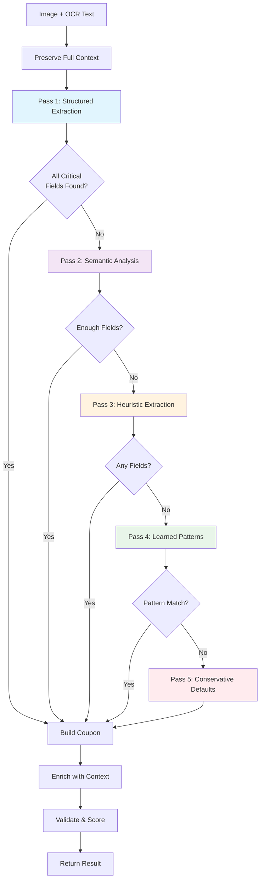

# 🎯 Universal Extraction Solution: Progressive Refinement Pipeline

## Design Principles

### 1. **Progressive Refinement**
Start with high-precision strategies, progressively relax to high-recall strategies:
```
Structured Patterns → Semantic Analysis → Heuristics → Learned Patterns → Conservative Defaults
```

### 2. **Data Preservation**
Keep all intermediate results for fallback and debugging:
```kotlin
data class ExtractionAttempt(
    val strategy: String,
    val confidence: Float,
    val extractedFields: Map<FieldType, String>,
    val rawData: String,  // Original OCR text
    val timestamp: Long
)
```

### 3. **Confidence Adaptation**
Adjust thresholds based on context:
```kotlin
fun adaptiveThreshold(fieldType: FieldType, attemptNumber: Int): Float {
    val baseThreshold = when (fieldType) {
        FieldType.STORE_NAME -> 0.4f
        FieldType.AMOUNT -> 0.5f
        FieldType.COUPON_CODE -> 0.6f
        FieldType.EXPIRY_DATE -> 0.4f
    }
    return baseThreshold * (0.9f.pow(attemptNumber))  // Relax by 10% each attempt
}
```

### 4. **No Information Loss**
OCR text flows through all stages as context.

---

## Architecture: Multi-Pass Extraction Pipeline



---

## Implementation Plan

### **Phase 1: Context Preservation Layer** (Foundation)

#### 1.1 Create `ExtractionContext` Data Structure
```kotlin
data class ExtractionContext(
    val imageUri: String,
    val ocrText: String,                                    // Full OCR output
    val ocrBlocks: List<TextBlock>,                         // Structured OCR blocks
    val metadata: Map<String, String> = emptyMap(),         // Image metadata
    val attempts: MutableList<ExtractionAttempt> = mutableListOf()
)

data class TextBlock(
    val text: String,
    val bounds: RectF,
    val confidence: Float,
    val language: String?
)

data class ExtractionAttempt(
    val passName: String,
    val strategy: String,
    val timestamp: Long,
    val durationMs: Long,
    val fieldsExtracted: Map<FieldType, FieldCandidate>,
    val confidence: Float,
    val reason: String?
)

data class FieldCandidate(
    val value: String,
    val confidence: Float,
    val source: String,        // "pattern", "semantic", "heuristic", "learned", "default"
    val context: String?       // Surrounding text or reason
)
```

**Files to Create**:
- `app/src/main/kotlin/com/example/coupontracker/extraction/ExtractionContext.kt`

---

### **Phase 2: Pass 1 - Structured Pattern Extraction** (Keep Current, Improve)

#### 2.1 Enhance `UniversalFieldDetector`
```kotlin
suspend fun detectFieldsStructured(
    context: ExtractionContext,
    minConfidence: Float = 0.4f
): Map<FieldType, List<FieldCandidate>> {
    
    val startTime = System.currentTimeMillis()
    val results = mutableMapOf<FieldType, MutableList<FieldCandidate>>()
    
    // Store Name: Multiple strategies
    results[FieldType.STORE_NAME] = detectStoreName_AllStrategies(context, minConfidence)
    
    // Amount: Handle compound expressions
    results[FieldType.AMOUNT] = detectAmount_CompoundAware(context, minConfidence)
    
    // Expiry: Handle relative dates
    results[FieldType.EXPIRY_DATE] = detectExpiry_RelativeAware(context, minConfidence)
    
    // Code: Pattern + no-code detection
    results[FieldType.COUPON_CODE] = detectCode_OrMarkNotNeeded(context, minConfidence)
    
    // Record attempt
    context.attempts.add(ExtractionAttempt(
        passName = "Pass 1: Structured",
        strategy = "pattern_matching",
        timestamp = startTime,
        durationMs = System.currentTimeMillis() - startTime,
        fieldsExtracted = results.mapValues { it.value.firstOrNull() ?: FieldCandidate("", 0f, "pattern", null) },
        confidence = results.values.flatten().map { it.confidence }.average().toFloat(),
        reason = "Structured pattern matching"
    ))
    
    return results
}
```

#### 2.2 Improve Store Name Detection (No Brand List!)
```kotlin
private fun detectStoreName_AllStrategies(
    context: ExtractionContext,
    minConfidence: Float
): List<FieldCandidate> {
    val candidates = mutableListOf<FieldCandidate>()
    
    // Strategy 1: Explicit context patterns ("from X", "at Y", "via Z")
    val explicitPattern = Regex("""(?:from|at|via|by)\s+([A-Z][A-Za-z0-9&.'-]{1,20})""", RegexOption.IGNORE_CASE)
    explicitPattern.findAll(context.ocrText).forEach { match ->
        candidates.add(FieldCandidate(
            value = match.groupValues[1],
            confidence = 0.8f,  // High confidence for explicit context
            source = "explicit_pattern",
            context = match.value
        ))
    }
    
    // Strategy 2: ALL CAPS words (likely brand names)
    val allCapsPattern = Regex("""\b([A-Z]{2,})\b""")
    allCapsPattern.findAll(context.ocrText).forEach { match ->
        val word = match.value
        if (word !in COMMON_WORDS && word.length in 3..15) {
            candidates.add(FieldCandidate(
                value = word,
                confidence = 0.5f,  // Medium confidence
                source = "all_caps",
                context = getWordContext(context.ocrText, match.range)
            ))
        }
    }
    
    // Strategy 3: Title Case words in first 20% of text
    val textLength = context.ocrText.length
    val earlyText = context.ocrText.take((textLength * 0.2).toInt())
    val titleCasePattern = Regex("""\b([A-Z][a-z]{2,}(?:\s+[A-Z][a-z]{2,}){0,2})\b""")
    titleCasePattern.findAll(earlyText).forEach { match ->
        candidates.add(FieldCandidate(
            value = match.value,
            confidence = 0.6f,  // Medium-high confidence for early position
            source = "title_case_early",
            context = "Found in first 20% of text"
        ))
    }
    
    // Strategy 4: Repeated words (brand names often repeat)
    val wordFrequency = mutableMapOf<String, Int>()
    Regex("""\b([A-Z][A-Za-z]{2,})\b""").findAll(context.ocrText).forEach { match ->
        val word = match.value
        wordFrequency[word] = wordFrequency.getOrDefault(word, 0) + 1
    }
    wordFrequency.filter { it.value >= 2 }.forEach { (word, count) ->
        candidates.add(FieldCandidate(
            value = word,
            confidence = 0.4f + (count * 0.1f).coerceAtMost(0.3f),
            source = "repeated_word",
            context = "Appears $count times"
        ))
    }
    
    return candidates.filter { it.confidence >= minConfidence }
        .sortedByDescending { it.confidence }
}

private fun getWordContext(text: String, range: IntRange): String {
    val start = (range.first - 20).coerceAtLeast(0)
    val end = (range.last + 20).coerceAtMost(text.length)
    return text.substring(start, end)
}

companion object {
    private val COMMON_WORDS = setOf(
        "THE", "AND", "FOR", "YOU", "GET", "WITH", "FROM", "EXPIRES", "CODE",
        "COUPON", "OFFER", "VALID", "UPTO", "FLAT", "OFF", "CASHBACK"
    )
}
```

#### 2.3 Compound Amount Detection
```kotlin
private fun detectAmount_CompoundAware(
    context: ExtractionContext,
    minConfidence: Float
): List<FieldCandidate> {
    val candidates = mutableListOf<FieldCandidate>()
    
    // Pattern 1: Compound expression "₹A + ₹B cashback"
    val compoundPattern = Regex("""₹\s*([0-9,]+)\s*\+\s*₹\s*([0-9,]+)\s*(cashback|off|discount)""", RegexOption.IGNORE_CASE)
    compoundPattern.findAll(context.ocrText).forEach { match ->
        val baseAmount = match.groupValues[1].replace(",", "")
        val cashbackAmount = match.groupValues[2].replace(",", "")
        val type = match.groupValues[3]
        
        // Prioritize cashback component
        candidates.add(FieldCandidate(
            value = "₹$cashbackAmount $type",
            confidence = 0.9f,  // Very high confidence for explicit cashback
            source = "compound_cashback",
            context = match.value
        ))
        
        // Also add base amount with lower confidence
        candidates.add(FieldCandidate(
            value = "₹$baseAmount",
            confidence = 0.5f,
            source = "compound_base",
            context = match.value
        ))
    }
    
    // Pattern 2: Simple amount with context
    val simplePattern = Regex("""(?:₹|Rs\.?|INR)\s*([0-9,]+(?:\.[0-9]{1,2})?)\s*(off|cashback|discount|save)?""", RegexOption.IGNORE_CASE)
    simplePattern.findAll(context.ocrText).forEach { match ->
        val amount = match.groupValues[1].replace(",", "")
        val context_word = match.groupValues[2]
        
        val confidence = if (context_word.isNotBlank()) 0.7f else 0.4f
        candidates.add(FieldCandidate(
            value = if (context_word.isNotBlank()) "₹$amount $context_word" else "₹$amount",
            confidence = confidence,
            source = "simple_amount",
            context = match.value
        ))
    }
    
    // Pattern 3: Percentage
    val percentPattern = Regex("""([0-9]+(?:\.[0-9]{1,2})?)\s*%\s*(off|discount|cashback)?""", RegexOption.IGNORE_CASE)
    percentPattern.findAll(context.ocrText).forEach { match ->
        candidates.add(FieldCandidate(
            value = "${match.groupValues[1]}%",
            confidence = 0.8f,
            source = "percentage",
            context = match.value
        ))
    }
    
    return candidates.filter { it.confidence >= minConfidence }
        .sortedByDescending { it.confidence }
}
```

#### 2.4 Relative Expiry Detection
```kotlin
private fun detectExpiry_RelativeAware(
    context: ExtractionContext,
    minConfidence: Float
): List<FieldCandidate> {
    val candidates = mutableListOf<FieldCandidate>()
    
    // Pattern 1: "Expires in X days"
    val relativePattern = Regex("""(?:expires?|valid)\s+in\s+(\d+)\s+(days?|weeks?|months?)""", RegexOption.IGNORE_CASE)
    relativePattern.findAll(context.ocrText).forEach { match ->
        val count = match.groupValues[1].toIntOrNull() ?: return@forEach
        val unit = match.groupValues[2].lowercase()
        
        val calendar = Calendar.getInstance()
        when {
            unit.startsWith("day") -> calendar.add(Calendar.DAY_OF_YEAR, count)
            unit.startsWith("week") -> calendar.add(Calendar.WEEK_OF_YEAR, count)
            unit.startsWith("month") -> calendar.add(Calendar.MONTH, count)
        }
        
        val dateFormat = SimpleDateFormat("yyyy-MM-dd", Locale.US)
        candidates.add(FieldCandidate(
            value = dateFormat.format(calendar.time),
            confidence = 0.9f,  // Very high confidence
            source = "relative_date",
            context = match.value
        ))
    }
    
    // Pattern 2: Absolute dates
    val absolutePattern = Regex("""(\d{1,2}[/-]\d{1,2}[/-]\d{2,4})""")
    absolutePattern.findAll(context.ocrText).forEach { match ->
        candidates.add(FieldCandidate(
            value = match.value,
            confidence = 0.8f,
            source = "absolute_date",
            context = getWordContext(context.ocrText, match.range)
        ))
    }
    
    return candidates.filter { it.confidence >= minConfidence }
        .sortedByDescending { it.confidence }
}
```

#### 2.5 Code Detection with "No Code Needed" Support
```kotlin
private fun detectCode_OrMarkNotNeeded(
    context: ExtractionContext,
    minConfidence: Float
): List<FieldCandidate> {
    val candidates = mutableListOf<FieldCandidate>()
    
    // Pattern 1: Explicit code patterns
    val codePattern = Regex("""\b([A-Z0-9]{6,15})\b""")
    codePattern.findAll(context.ocrText).forEach { match ->
        val code = match.value
        // Validate it's not a common word
        if (code !in COMMON_WORDS && code.any { it.isDigit() }) {
            candidates.add(FieldCandidate(
                value = code,
                confidence = 0.7f,
                source = "code_pattern",
                context = getWordContext(context.ocrText, match.range)
            ))
        }
    }
    
    // Pattern 2: Check for "no code" indicators
    val noCodePatterns = listOf(
        "no code needed", "no code required", "cashback", "automatic", "auto-applied"
    )
    val hasNoCodeIndicator = noCodePatterns.any { context.ocrText.contains(it, ignoreCase = true) }
    
    if (hasNoCodeIndicator && candidates.isEmpty()) {
        candidates.add(FieldCandidate(
            value = "NO_CODE_NEEDED",
            confidence = 0.8f,
            source = "no_code_indicator",
            context = "Cashback/auto-applied offer"
        ))
    }
    
    return candidates.filter { it.confidence >= minConfidence }
        .sortedByDescending { it.confidence }
}
```

---

### **Phase 3: Pass 2 - Semantic Analysis** (New!)

#### 3.1 Create `SemanticFieldExtractor`
```kotlin
class SemanticFieldExtractor {
    
    suspend fun extractFieldsSemantic(
        context: ExtractionContext,
        missingFields: Set<FieldType>
    ): Map<FieldType, List<FieldCandidate>> {
        
        val startTime = System.currentTimeMillis()
        val results = mutableMapOf<FieldType, MutableList<FieldCandidate>>()
        
        // Analyze sentences for semantic patterns
        val sentences = context.ocrText.split(Regex("[.!?\n]+")).map { it.trim() }
        
        for (sentence in sentences) {
            if (FieldType.STORE_NAME in missingFields) {
                extractStoreFromSentence(sentence)?.let {
                    results.getOrPut(FieldType.STORE_NAME) { mutableListOf() }.add(it)
                }
            }
            
            if (FieldType.AMOUNT in missingFields) {
                extractAmountFromSentence(sentence)?.let {
                    results.getOrPut(FieldType.AMOUNT) { mutableListOf() }.add(it)
                }
            }
        }
        
        // Record attempt
        context.attempts.add(ExtractionAttempt(
            passName = "Pass 2: Semantic",
            strategy = "sentence_analysis",
            timestamp = startTime,
            durationMs = System.currentTimeMillis() - startTime,
            fieldsExtracted = results.mapValues { it.value.firstOrNull() ?: FieldCandidate("", 0f, "semantic", null) },
            confidence = results.values.flatten().map { it.confidence }.average().toFloat(),
            reason = "Semantic sentence analysis"
        ))
        
        return results
    }
    
    private fun extractStoreFromSentence(sentence: String): FieldCandidate? {
        // Pattern: "you get X from Y" → Y is store
        val pattern1 = Regex("""you\s+(?:get|won)\s+.+?\s+(?:from|at|via)\s+([A-Z][A-Za-z0-9&.'-]+)""", RegexOption.IGNORE_CASE)
        pattern1.find(sentence)?.let { match ->
            return FieldCandidate(
                value = match.groupValues[1],
                confidence = 0.75f,
                source = "semantic_from",
                context = sentence
            )
        }
        
        // Pattern: "STORE NAME cashback" → STORE NAME is likely the store
        val pattern2 = Regex("""([A-Z][A-Za-z0-9&.'-]+)\s+(?:cashback|rewards|offer)""", RegexOption.IGNORE_CASE)
        pattern2.find(sentence)?.let { match ->
            return FieldCandidate(
                value = match.groupValues[1],
                confidence = 0.65f,
                source = "semantic_cashback",
                context = sentence
            )
        }
        
        return null
    }
    
    private fun extractAmountFromSentence(sentence: String): FieldCandidate? {
        // Find all numbers in sentence
        val numbers = Regex("""₹\s*([0-9,]+)""").findAll(sentence).toList()
        
        // If "cashback" appears, prefer number after it
        if (sentence.contains("cashback", ignoreCase = true)) {
            val cashbackIndex = sentence.indexOf("cashback", ignoreCase = true)
            numbers.lastOrNull { it.range.first < cashbackIndex }?.let { match ->
                return FieldCandidate(
                    value = "₹${match.groupValues[1]} cashback",
                    confidence = 0.7f,
                    source = "semantic_cashback_amount",
                    context = sentence
                )
            }
        }
        
        // Otherwise, return last number (often the most important)
        numbers.lastOrNull()?.let { match ->
            return FieldCandidate(
                value = "₹${match.groupValues[1]}",
                confidence = 0.5f,
                source = "semantic_last_number",
                context = sentence
            )
        }
        
        return null
    }
}
```

**Files to Create**:
- `app/src/main/kotlin/com/example/coupontracker/extraction/SemanticFieldExtractor.kt`

---

### **Phase 4: Pass 3 - Heuristic Extraction** (Fallback)

#### 4.1 Create `HeuristicFieldExtractor`
```kotlin
class HeuristicFieldExtractor {
    
    fun extractFieldsHeuristic(
        context: ExtractionContext,
        missingFields: Set<FieldType>
    ): Map<FieldType, List<FieldCandidate>> {
        
        val results = mutableMapOf<FieldType, MutableList<FieldCandidate>>()
        
        // Store: ANY capitalized word
        if (FieldType.STORE_NAME in missingFields) {
            val anyCapital = Regex("""\b([A-Z][A-Za-z0-9]{2,})\b""").find(context.ocrText)
            anyCapital?.let {
                results.getOrPut(FieldType.STORE_NAME) { mutableListOf() }.add(
                    FieldCandidate(
                        value = it.value,
                        confidence = 0.3f,  // Low confidence, but better than nothing
                        source = "heuristic_capital",
                        context = "First capitalized word"
                    )
                )
            }
        }
        
        // Amount: ANY number
        if (FieldType.AMOUNT in missingFields) {
            val anyNumber = Regex("""[0-9]+""").find(context.ocrText)
            anyNumber?.let {
                results.getOrPut(FieldType.AMOUNT) { mutableListOf() }.add(
                    FieldCandidate(
                        value = it.value,
                        confidence = 0.2f,  // Very low confidence
                        source = "heuristic_number",
                        context = "First number found"
                    )
                )
            }
        }
        
        return results
    }
}
```

**Files to Create**:
- `app/src/main/kotlin/com/example/coupontracker/extraction/HeuristicFieldExtractor.kt`

---

### **Phase 5: Pass 4 - Learned Patterns** (Use Existing)

Use existing `PatternLearningEngine` but with lower confidence threshold.

---

### **Phase 6: Pass 5 - Conservative Defaults** (Always Succeeds)

#### 6.1 Create `DefaultFieldProvider`
```kotlin
class DefaultFieldProvider {
    
    fun provideDefaults(
        context: ExtractionContext,
        missingFields: Set<FieldType>
    ): Map<FieldType, FieldCandidate> {
        
        val defaults = mutableMapOf<FieldType, FieldCandidate>()
        
        // Store: Use first sentence or "Coupon"
        if (FieldType.STORE_NAME in missingFields) {
            val firstLine = context.ocrText.lines().firstOrNull { it.trim().isNotEmpty() } ?: "Coupon"
            defaults[FieldType.STORE_NAME] = FieldCandidate(
                value = firstLine.take(30),  // Truncate long lines
                confidence = 0.1f,
                source = "default_first_line",
                context = "No store found, using first line"
            )
        }
        
        // Description: Use full OCR text (truncated)
        val description = context.ocrText.take(200)
        defaults[FieldType.DESCRIPTION] = FieldCandidate(
            value = description,
            confidence = 0.5f,  // Medium confidence for OCR text as description
            source = "default_ocr_text",
            context = "Using OCR text as description"
        )
        
        // Amount: 0.0 (but marked as uncertain)
        if (FieldType.AMOUNT in missingFields) {
            defaults[FieldType.AMOUNT] = FieldCandidate(
                value = "0.0",
                confidence = 0.0f,
                source = "default_zero",
                context = "No amount found"
            )
        }
        
        // Code: NO_CODE_NEEDED (assume cashback)
        if (FieldType.COUPON_CODE in missingFields) {
            defaults[FieldType.COUPON_CODE] = FieldCandidate(
                value = "NO_CODE_NEEDED",
                confidence = 0.3f,
                source = "default_no_code",
                context = "No code pattern found, assuming no code needed"
            )
        }
        
        return defaults
    }
}
```

**Files to Create**:
- `app/src/main/kotlin/com/example/coupontracker/extraction/DefaultFieldProvider.kt`

---

### **Phase 7: Orchestration - Progressive Extraction Pipeline**

#### 7.1 Rewrite `UniversalExtractionService`
```kotlin
@Singleton
class ProgressiveExtractionService @Inject constructor(
    private val structuredExtractor: UniversalFieldDetector,
    private val semanticExtractor: SemanticFieldExtractor,
    private val heuristicExtractor: HeuristicFieldExtractor,
    private val learnedPatternEngine: PatternLearningEngine,
    private val defaultProvider: DefaultFieldProvider
) {
    companion object {
        private const val TAG = "ProgressiveExtractionService"
        
        // Define critical fields that must be extracted
        private val CRITICAL_FIELDS = setOf(FieldType.STORE_NAME, FieldType.DESCRIPTION)
    }
    
    suspend fun extractCoupon(
        image: Bitmap,
        ocrText: String,
        ocrBlocks: List<TextBlock>,
        imageUri: String
    ): UniversalExtractionResult = withContext(Dispatchers.Default) {
        
        val context = ExtractionContext(
            imageUri = imageUri,
            ocrText = ocrText,
            ocrBlocks = ocrBlocks,
            metadata = emptyMap(),
            attempts = mutableListOf()
        )
        
        val extractedFields = mutableMapOf<FieldType, FieldCandidate>()
        var currentConfidenceThreshold = 0.4f
        
        // PASS 1: Structured Pattern Matching
        Log.d(TAG, "Pass 1: Structured extraction")
        val structuredResults = structuredExtractor.detectFieldsStructured(context, currentConfidenceThreshold)
        mergeResults(extractedFields, structuredResults)
        
        // Check if we have all critical fields
        val missingCritical = CRITICAL_FIELDS - extractedFields.keys
        if (missingCritical.isEmpty()) {
            Log.d(TAG, "✅ All critical fields found in Pass 1")
            return@withContext buildResult(context, extractedFields, image, imageUri)
        }
        
        // PASS 2: Semantic Analysis
        Log.d(TAG, "Pass 2: Semantic analysis for missing fields: $missingCritical")
        currentConfidenceThreshold = 0.3f  // Relax threshold
        val semanticResults = semanticExtractor.extractFieldsSemantic(context, missingCritical)
        mergeResults(extractedFields, semanticResults, replaceIfBetter = false)  // Don't override existing
        
        val stillMissing = CRITICAL_FIELDS - extractedFields.keys
        if (stillMissing.isEmpty()) {
            Log.d(TAG, "✅ All critical fields found after Pass 2")
            return@withContext buildResult(context, extractedFields, image, imageUri)
        }
        
        // PASS 3: Heuristic Extraction
        Log.d(TAG, "Pass 3: Heuristic extraction for missing fields: $stillMissing")
        currentConfidenceThreshold = 0.2f
        val heuristicResults = heuristicExtractor.extractFieldsHeuristic(context, stillMissing)
        mergeResults(extractedFields, heuristicResults, replaceIfBetter = false)
        
        // PASS 4: Learned Patterns
        Log.d(TAG, "Pass 4: Learned patterns")
        val allMissing = FieldType.values().toSet() - extractedFields.keys
        for (fieldType in allMissing) {
            val learnedPatterns = learnedPatternEngine.getRelevantPatterns(fieldType, ExtractionContext())
            if (learnedPatterns.isNotEmpty()) {
                // Apply learned patterns
                val learnedCandidates = applyLearnedPatterns(context.ocrText, learnedPatterns)
                if (learnedCandidates.isNotEmpty()) {
                    extractedFields[fieldType] = learnedCandidates.first()
                }
            }
        }
        
        // PASS 5: Conservative Defaults
        Log.d(TAG, "Pass 5: Applying conservative defaults")
        val finalMissing = FieldType.values().toSet() - extractedFields.keys
        val defaults = defaultProvider.provideDefaults(context, finalMissing)
        for ((fieldType, candidate) in defaults) {
            if (fieldType !in extractedFields) {
                extractedFields[fieldType] = candidate
            }
        }
        
        Log.d(TAG, "✅ Extraction complete after ${context.attempts.size} passes")
        buildResult(context, extractedFields, image, imageUri)
    }
    
    private fun mergeResults(
        target: MutableMap<FieldType, FieldCandidate>,
        source: Map<FieldType, List<FieldCandidate>>,
        replaceIfBetter: Boolean = true
    ) {
        for ((fieldType, candidates) in source) {
            if (candidates.isEmpty()) continue
            
            val bestCandidate = candidates.maxByOrNull { it.confidence } ?: continue
            
            if (fieldType !in target) {
                target[fieldType] = bestCandidate
            } else if (replaceIfBetter && bestCandidate.confidence > target[fieldType]!!.confidence) {
                target[fieldType] = bestCandidate
            }
        }
    }
    
    private fun buildResult(
        context: ExtractionContext,
        extractedFields: Map<FieldType, FieldCandidate>,
        image: Bitmap,
        imageUri: String
    ): UniversalExtractionResult {
        
        val coupon = buildCouponFromFields(extractedFields, imageUri, context)
        val overallConfidence = extractedFields.values.map { it.confidence }.average().toFloat()
        
        return UniversalExtractionResult(
            coupon = coupon,
            confidence = overallConfidence,
            extractedFields = extractedFields.mapValues { ExtractionCandidate(
                text = it.value.value,
                confidence = it.value.confidence,
                source = ExtractionSource.valueOf(it.value.source.uppercase()),
                context = mapOf("source" to it.value.source, "reason" to (it.value.context ?: ""))
            )},
            allCandidates = emptyMap(),  // Can populate if needed
            success = true,
            extractionAttempts = context.attempts
        )
    }
    
    private fun buildCouponFromFields(
        extractedFields: Map<FieldType, FieldCandidate>,
        imageUri: String,
        context: ExtractionContext
    ): Coupon {
        
        val storeName = extractedFields[FieldType.STORE_NAME]?.value ?: "Unknown Store"
        val description = extractedFields[FieldType.DESCRIPTION]?.value 
            ?: context.ocrText.take(200)  // ✅ ALWAYS use OCR text as fallback
        
        val redeemCode = extractedFields[FieldType.COUPON_CODE]?.value?.takeIf { it != "NO_CODE_NEEDED" }
        
        val expiryDate = extractedFields[FieldType.EXPIRY_DATE]?.value?.let { parseDate(it) }
        
        val (cashbackAmount, cashbackInfo) = extractedFields[FieldType.AMOUNT]?.value?.let {
            parseCashbackAmount(it)
        } ?: Pair(0.0, CashbackInfo(CashbackType.AMOUNT, 0.0))
        
        return Coupon(
            id = 0,
            storeName = storeName,
            description = description,
            expiryDate = expiryDate,
            cashbackAmount = cashbackAmount,
            redeemCode = redeemCode,
            imageUri = imageUri,
            cashbackType = cashbackInfo.type.name.lowercase(),
            cashbackValueNum = cashbackInfo.valueNum,
            cashbackCurrency = cashbackInfo.currency,
            category = null,
            rating = null,
            status = "ACTIVE",
            createdAt = Date(),
            updatedAt = Date()
        )
    }
}
```

**Files to Update**:
- `app/src/main/kotlin/com/example/coupontracker/extraction/ProgressiveExtractionService.kt` (new)
- Replace references to `UniversalExtractionService` with `ProgressiveExtractionService`

---

## Implementation Timeline

### Week 1: Foundation
- [ ] Create `ExtractionContext.kt`
- [ ] Create helper data classes
- [ ] Update `UniversalFieldDetector` with improved store/amount/expiry detection

### Week 2: Multi-Pass Pipeline
- [ ] Implement `SemanticFieldExtractor`
- [ ] Implement `HeuristicFieldExtractor`
- [ ] Implement `DefaultFieldProvider`

### Week 3: Orchestration
- [ ] Implement `ProgressiveExtractionService`
- [ ] Wire into existing pipeline
- [ ] Add logging and debugging

### Week 4: Testing & Refinement
- [ ] Test with diverse coupon types
- [ ] Tune confidence thresholds
- [ ] Add telemetry

---

## Benefits of This Approach

### 1. **Truly Universal**
- No brand lists
- No hardcoded patterns for specific stores
- Works with ANY coupon format

### 2. **Graceful Degradation**
- Always returns SOMETHING useful
- Never shows "Error processing coupon"
- OCR text always preserved as description

### 3. **Self-Improving**
- Learned patterns feed back into Pass 4
- Successful extractions strengthen patterns
- Failures don't break the pipeline

### 4. **Debuggable**
- Every extraction attempt is logged
- Can see exactly why a field was extracted a certain way
- Can replay and tune strategies

### 5. **Adaptive**
- Confidence thresholds relax progressively
- Multiple strategies increase recall
- No single point of failure

---

## Testing the Solution

### Test Case: CRED XYXX Voucher

**Input**:
```
you get XYXX polo t-shirts from ₹599 + ₹50 cashback via CRED pay
XYXX
⭐ 4.31
EXPIRES IN 05 DAYS
```

**Expected Output**:
- **Store**: XYXX (Pass 1: ALL CAPS or Pass 2: semantic "from XYXX")
- **Description**: "you get XYXX polo t-shirts from ₹599 + ₹50 cashback via CRED pay" (Pass 5: OCR text)
- **Amount**: ₹50 cashback (Pass 1: compound pattern)
- **Expiry**: 2025-10-06 (Pass 1: relative date)
- **Code**: NO_CODE_NEEDED (Pass 1: cashback indicator)

### Test Case: Generic Store

**Input**:
```
NewStore20
Get 15% off on all items
Code: SAVE15
Valid until 12/31/2024
```

**Expected Output**:
- **Store**: NewStore20 (Pass 1: Title Case early or Pass 3: ANY capital)
- **Description**: "Get 15% off on all items" (Pass 2: semantic or Pass 5: OCR text)
- **Amount**: 15% off (Pass 1: percentage pattern)
- **Expiry**: 2024-12-31 (Pass 1: absolute date)
- **Code**: SAVE15 (Pass 1: code pattern)

---

## Metrics to Track

1. **Pass Success Rate**: % of coupons resolved at each pass
2. **Field Confidence Distribution**: Histogram of field confidences
3. **Fallback Rate**: % of coupons using Pass 5 defaults
4. **Processing Time per Pass**: Latency profiling
5. **User Corrections**: Feed into learning loop

---

## Summary

This solution provides a **truly universal extraction pipeline** that:
- Never loses information (OCR text preserved)
- Always returns something useful (graceful degradation)
- Adapts to any coupon format (no brand lists)
- Learns from experience (pattern learning)
- Debuggable and tunable (logged attempts)

**No more "Error processing coupon"!**

