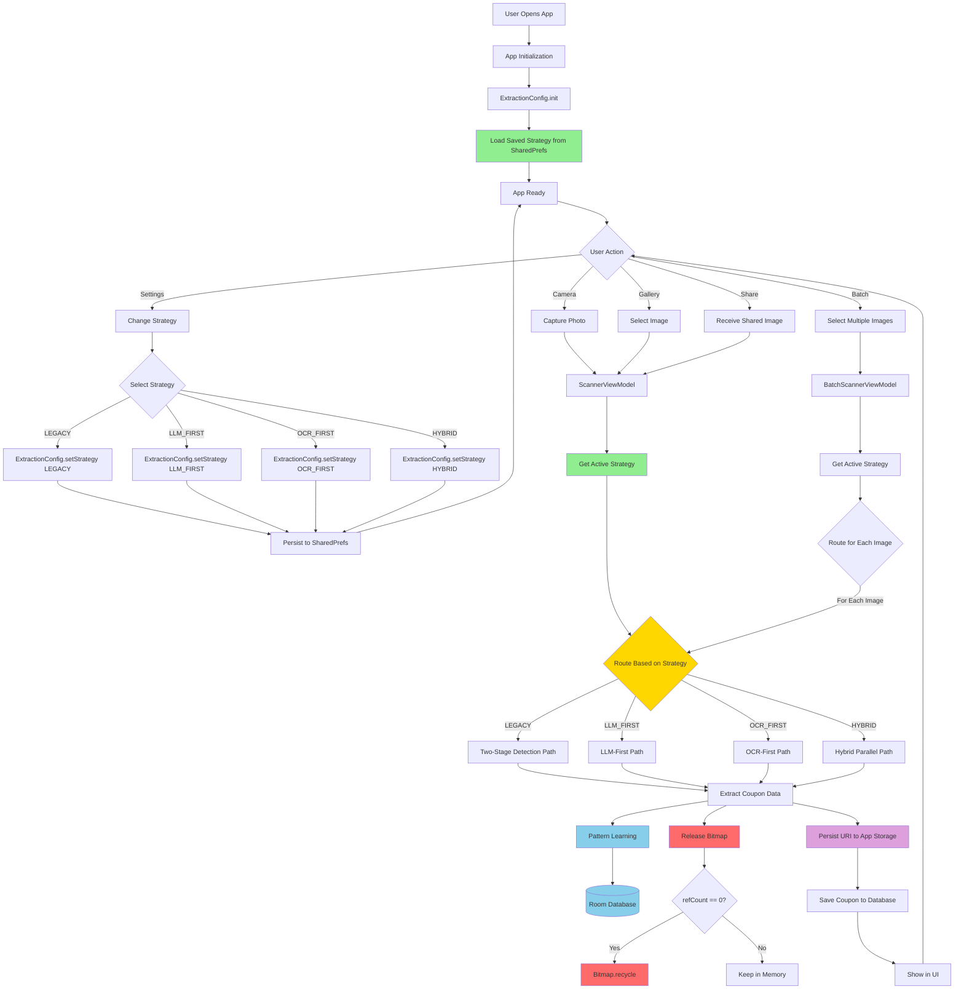
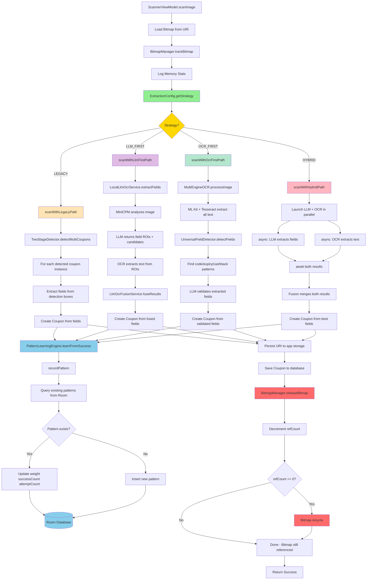
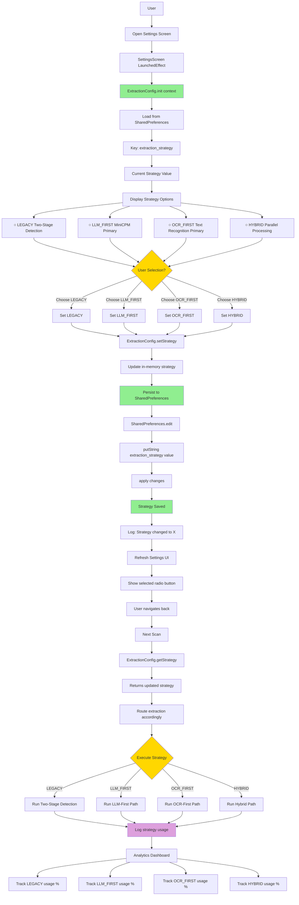

# V2 Architecture - Complete Implementation Flow
## Comprehensive Mermaid Charts

---

## 1. 🎯 Complete User Journey with V2 Architecture

---

## 2. 🔄 Strategy Routing - All Four Paths

---

## 3. 🧠 Pattern Learning - Room Integration

```mermaid
graph TB
    START[Extraction Success] --> CALL[PatternLearningEngine.learnFromSuccess]
    CALL --> EXTRACT_PAT[extractPattern from value]
    EXTRACT_PAT --> RECORD[recordPattern]
    
    RECORD --> GET_BRAND[Get brand from context]
    GET_BRAND --> QUERY{Brand specific?}
    
    QUERY -->|Yes| QUERY_BRAND[learnedPatternDao.getPatternsByBrandAndField]
    QUERY -->|No| QUERY_ALL[learnedPatternDao.getPatternsByField]
    
    QUERY_BRAND --> ROOM_QUERY[(Room Database Query)]
    QUERY_ALL --> ROOM_QUERY
    
    ROOM_QUERY --> FIND[Find pattern by regex match]
    FIND --> EXISTS{Pattern exists?}
    
    EXISTS -->|Yes| UPDATE_PATH[Update Existing Pattern]
    EXISTS -->|No| INSERT_PATH[Insert New Pattern]
    
    UPDATE_PATH --> CALC_NEW[newSuccessCount = old + 1]
    CALC_NEW --> CALC_ATT[newAttemptCount = old + 1]
    CALC_ATT --> CALC_WEIGHT[newWeight = success / attempt]
    CALC_WEIGHT --> UPDATE_COPY[pattern.copy with new values]
    UPDATE_COPY --> DAO_UPDATE[learnedPatternDao.updatePattern]
    
    INSERT_PATH --> CREATE_NEW[Create new LearnedPattern]
    CREATE_NEW --> SET_BRAND[brand = context.brandHint]
    SET_BRAND --> SET_FIELD[fieldType = fieldType.name]
    SET_FIELD --> SET_REGEX[regex = pattern]
    SET_REGEX --> SET_WEIGHT[weight = 0.7f or 0.3f]
    SET_WEIGHT --> SET_SOURCE[source = 'learned']
    SET_SOURCE --> SET_COUNTS[successCount = 1 attemptCount = 1]
    SET_COUNTS --> DAO_INSERT[learnedPatternDao.insertPattern]
    
    DAO_UPDATE --> ROOM_WRITE[(Room Database Write)]
    DAO_INSERT --> ROOM_WRITE
    
    ROOM_WRITE --> ENFORCE[Enforce pattern limit]
    ENFORCE --> COUNT[Count patterns for field]
    COUNT --> LIMIT{Count > MAX?}
    
    LIMIT -->|Yes| DELETE_LOW[Delete lowest weight patterns]
    LIMIT -->|No| COMPLETE[Pattern Learning Complete]
    
    DELETE_LOW --> SORT[Sort by weight ASC]
    SORT --> TAKE[Take excess patterns]
    TAKE --> DELETE_LOOP[Delete each by ID]
    DELETE_LOOP --> COMPLETE
    
    COMPLETE --> NEXT_USE[Pattern available for next extraction]
    
    NEXT_USE --> RETRIEVE[getRelevantPatterns called]
    RETRIEVE --> QUERY_AGAIN{Brand context?}
    QUERY_AGAIN -->|Yes| GET_BRAND_PAT[Query by brand + field]
    QUERY_AGAIN -->|No| GET_ALL_PAT[Query by field only]
    
    GET_BRAND_PAT --> ROOM_READ[(Room Database Read)]
    GET_ALL_PAT --> ROOM_READ
    
    ROOM_READ --> FILTER[Filter weight >= 0.5]
    FILTER --> SORT_DESC[Sort by weight DESC]
    SORT_DESC --> LIMIT_10[Take top 10 patterns]
    LIMIT_10 --> CONVERT[Convert to domain objects]
    CONVERT --> RETURN[Return patterns to extraction]
    
    style RECORD fill:#87CEEB
    style ROOM_QUERY fill:#4682B4
    style DAO_UPDATE fill:#4682B4
    style DAO_INSERT fill:#4682B4
    style ROOM_WRITE fill:#4682B4
    style ROOM_READ fill:#4682B4
    style EXISTS fill:#FFD700
    style LIMIT fill:#FFD700
```

---

## 4. 🎨 Bitmap Memory Management

```mermaid
graph TB
    START[Image Processing Begins] --> LOAD[Load Bitmap from URI]
    LOAD --> TRACK[BitmapManager.trackBitmap]
    
    TRACK --> SYNC1[synchronized managedBitmaps]
    SYNC1 --> CHECK_EXISTS{Bitmap already tracked?}
    
    CHECK_EXISTS -->|Yes| INCREMENT[Increment refCount]
    CHECK_EXISTS -->|No| CREATE[Create ManagedBitmap]
    
    CREATE --> SET_REF[refCount = 1]
    SET_REF --> CALC_SIZE[size = width * height * 4]
    CALC_SIZE --> ADD_MAP[Add to managedBitmaps map]
    ADD_MAP --> UPDATE_TOTAL[totalPixels += size]
    
    INCREMENT --> UPDATE_TOTAL
    
    UPDATE_TOTAL --> CHECK_BUDGET{totalPixels > budget?}
    
    CHECK_BUDGET -->|Yes| ENFORCE[enforcePixelBudgetInternal]
    CHECK_BUDGET -->|No| TRACK_DONE[Tracking Complete]
    
    ENFORCE --> FIND_UNREF[Find bitmaps with refCount == 0]
    FIND_UNREF --> SORT_SIZE[Sort by size DESC]
    SORT_SIZE --> RECYCLE_LOOP[For each unreferenced]
    RECYCLE_LOOP --> RECYCLE_ONE[bitmap.recycle]
    RECYCLE_ONE --> REMOVE_MAP[Remove from map]
    REMOVE_MAP --> SUB_TOTAL[totalPixels -= size]
    SUB_TOTAL --> CHECK_UNDER{totalPixels < budget?}
    
    CHECK_UNDER -->|No| RECYCLE_LOOP
    CHECK_UNDER -->|Yes| ENFORCE_DONE[Budget enforced]
    ENFORCE_DONE --> TRACK_DONE
    
    TRACK_DONE --> PROCESS[Image Processing...]
    
    PROCESS --> CROP1[Crop for ROI 1]
    CROP1 --> TRACK_CROP1[BitmapManager.trackBitmap crop1]
    TRACK_CROP1 --> PROCESS_CROP1[Process crop 1]
    PROCESS_CROP1 --> RELEASE_CROP1[BitmapManager.releaseBitmap crop1]
    
    PROCESS --> CROP2[Crop for ROI 2]
    CROP2 --> TRACK_CROP2[BitmapManager.trackBitmap crop2]
    TRACK_CROP2 --> PROCESS_CROP2[Process crop 2]
    PROCESS_CROP2 --> RELEASE_CROP2[BitmapManager.releaseBitmap crop2]
    
    RELEASE_CROP1 --> SYNC_REL1[synchronized managedBitmaps]
    RELEASE_CROP2 --> SYNC_REL2[synchronized managedBitmaps]
    
    SYNC_REL1 --> DEC1[Decrement refCount]
    SYNC_REL2 --> DEC2[Decrement refCount]
    
    DEC1 --> ZERO1{refCount == 0?}
    DEC2 --> ZERO2{refCount == 0?}
    
    ZERO1 -->|Yes| REC1[bitmap.recycle]
    ZERO1 -->|No| KEEP1[Keep in memory]
    ZERO2 -->|Yes| REC2[bitmap.recycle]
    ZERO2 -->|No| KEEP2[Keep in memory]
    
    REC1 --> REM1[Remove from map]
    REC2 --> REM2[Remove from map]
    REM1 --> SUB1[totalPixels -= size]
    REM2 --> SUB2[totalPixels -= size]
    
    PROCESS --> DONE_PROC[Processing Complete]
    SUB1 --> DONE_PROC
    SUB2 --> DONE_PROC
    KEEP1 --> DONE_PROC
    KEEP2 --> DONE_PROC
    
    DONE_PROC --> RELEASE_ORIG[BitmapManager.releaseBitmap original]
    RELEASE_ORIG --> SYNC_FINAL[synchronized managedBitmaps]
    SYNC_FINAL --> DEC_ORIG[Decrement original refCount]
    DEC_ORIG --> ZERO_ORIG{refCount == 0?}
    
    ZERO_ORIG -->|Yes| REC_ORIG[original.recycle]
    ZERO_ORIG -->|No| KEEP_ORIG[Still referenced]
    
    REC_ORIG --> REM_ORIG[Remove from map]
    REM_ORIG --> SUB_ORIG[totalPixels -= size]
    SUB_ORIG --> COMPLETE[Memory Management Complete]
    KEEP_ORIG --> COMPLETE
    
    COMPLETE --> LOG[Log final memory stats]
    
    style TRACK fill:#90EE90
    style SYNC1 fill:#FFD700
    style CHECK_BUDGET fill:#FFD700
    style ENFORCE fill:#FF6B6B
    style RECYCLE_ONE fill:#FF6B6B
    style REC1 fill:#FF6B6B
    style REC2 fill:#FF6B6B
    style REC_ORIG fill:#FF6B6B
    style RELEASE_ORIG fill:#FF6B6B
```

---

## 5. 🔄 Complete Data Flow - End to End

```mermaid
graph TB
    USER[User] --> CAPTURE[Capture/Select Image]
    CAPTURE --> URI[Image URI]
    
    URI --> VM[ScannerViewModel.scanImage]
    VM --> INIT[Initialize ExtractionConfig if needed]
    INIT --> GET_STRAT[ExtractionConfig.getStrategy]
    GET_STRAT --> CURRENT_STRAT[Current Strategy: LEGACY/LLM_FIRST/OCR_FIRST/HYBRID]
    
    CURRENT_STRAT --> LOAD_BMP[Load Bitmap from URI]
    LOAD_BMP --> TRACK_BMP[BitmapManager.trackBitmap original]
    TRACK_BMP --> MEM_LOG[Log memory stats]
    
    MEM_LOG --> ROUTE{Route by Strategy}
    
    ROUTE -->|LEGACY| TWO_STAGE[TwoStageDetector]
    ROUTE -->|LLM_FIRST| LLM_SERVICE[LocalLlmOcrService]
    ROUTE -->|OCR_FIRST| MULTI_OCR[MultiEngineOCR]
    ROUTE -->|HYBRID| PARALLEL[Parallel LLM + OCR]
    
    TWO_STAGE --> STAGE1[Stage 1: Detect Coupons]
    STAGE1 --> VALIDATE[CouponInstanceValidator]
    VALIDATE --> STAGE2[Stage 2: Detect Fields]
    STAGE2 --> FIELDS_LEG[Field Bounding Boxes]
    
    LLM_SERVICE --> MINICPM[MiniCPM-Llama3-V2.5]
    MINICPM --> LLM_FIELDS[LLM Field Candidates]
    LLM_FIELDS --> ROI_OCR[OCR on LLM ROIs]
    ROI_OCR --> FUSION_LLM[LlmOcrFusionService]
    FUSION_LLM --> FIELDS_LLM[Fused Fields]
    
    MULTI_OCR --> MLKIT[ML Kit OCR]
    MULTI_OCR --> TESS[Tesseract OCR]
    MLKIT --> ALL_TEXT[All Extracted Text]
    TESS --> ALL_TEXT
    ALL_TEXT --> UNIVERSAL[UniversalFieldDetector]
    UNIVERSAL --> PATTERNS[PatternLearningEngine.getRelevantPatterns]
    PATTERNS --> ROOM_READ[(Room: Query Patterns)]
    ROOM_READ --> APPLY_PAT[Apply learned patterns]
    APPLY_PAT --> FIELDS_OCR[OCR-detected Fields]
    
    PARALLEL --> PAR_LLM[async: LLM path]
    PARALLEL --> PAR_OCR[async: OCR path]
    PAR_LLM --> LLM_RESULT[LLM Results]
    PAR_OCR --> OCR_RESULT[OCR Results]
    LLM_RESULT --> AWAIT[await both]
    OCR_RESULT --> AWAIT
    AWAIT --> FUSION_HYB[Fusion Service]
    FUSION_HYB --> FIELDS_HYB[Best of Both]
    
    FIELDS_LEG --> PARSE[Parse & Normalize Fields]
    FIELDS_LLM --> PARSE
    FIELDS_OCR --> PARSE
    FIELDS_HYB --> PARSE
    
    PARSE --> DATE_PARSE[IndianDateParser]
    PARSE --> CURRENCY_PARSE[IndianCurrencyParser]
    PARSE --> CODE_VALID[Code Validation]
    
    DATE_PARSE --> NORMALIZED[Normalized Fields]
    CURRENCY_PARSE --> NORMALIZED
    CODE_VALID --> NORMALIZED
    
    NORMALIZED --> BUILD_COUPON[Build Coupon Object]
    BUILD_COUPON --> TYPED_CASHBACK[Typed Cashback: percent/amount/text]
    TYPED_CASHBACK --> COUPON_OBJ[Coupon Object]
    
    COUPON_OBJ --> LEARN_SUCCESS[PatternLearningEngine.learnFromSuccess]
    LEARN_SUCCESS --> EXTRACT_PAT[Extract patterns from fields]
    EXTRACT_PAT --> RECORD_PAT[recordPattern for each field]
    RECORD_PAT --> ROOM_WRITE[(Room: Insert/Update Pattern)]
    
    COUPON_OBJ --> PERSIST_URI[UriPersistenceManager.persistUri]
    PERSIST_URI --> COPY_FILE[Copy to app-private storage]
    COPY_FILE --> PERSISTED_URI[Persisted URI]
    PERSISTED_URI --> UPDATE_COUPON[Update coupon.imageUri]
    
    UPDATE_COUPON --> SAVE_DB[CouponRepository.insertCoupon]
    SAVE_DB --> COUPON_DB[(Room: Coupon Table)]
    
    COUPON_DB --> RELEASE_ALL[Release all bitmaps in finally]
    RELEASE_ALL --> REL1[releaseBitmap original]
    RELEASE_ALL --> REL2[releaseBitmap crops]
    
    REL1 --> CHECK_REF1{refCount == 0?}
    REL2 --> CHECK_REF2{refCount == 0?}
    
    CHECK_REF1 -->|Yes| RECYCLE1[Bitmap.recycle]
    CHECK_REF1 -->|No| KEEP1[Keep alive]
    CHECK_REF2 -->|Yes| RECYCLE2[Bitmap.recycle]
    CHECK_REF2 -->|No| KEEP2[Keep alive]
    
    RECYCLE1 --> CLEANUP[Memory cleanup]
    RECYCLE2 --> CLEANUP
    KEEP1 --> CLEANUP
    KEEP2 --> CLEANUP
    
    CLEANUP --> UI_UPDATE[Update UI State]
    UI_UPDATE --> NAVIGATE[Navigate to CouponFormScreen]
    NAVIGATE --> DISPLAY[Display Extracted Coupon]
    
    DISPLAY --> USER_REVIEW{User Reviews}
    USER_REVIEW -->|Correct| CONFIRM[confirmExtractionCorrect]
    USER_REVIEW -->|Wrong| FEEDBACK[User provides corrections]
    
    CONFIRM --> LEARN_CONF[learnFromSuccess - increase confidence]
    FEEDBACK --> LEARN_CORR[learnFromCorrection - learn new patterns]
    
    LEARN_CONF --> ROOM_UPDATE1[(Room: Update Patterns)]
    LEARN_CORR --> ROOM_UPDATE2[(Room: Insert New Patterns)]
    
    ROOM_UPDATE1 --> FEEDBACK_DB[(Room: Feedback Table)]
    ROOM_UPDATE2 --> FEEDBACK_DB
    
    FEEDBACK_DB --> IMPROVE[System Learns & Improves]
    
    style GET_STRAT fill:#90EE90
    style ROUTE fill:#FFD700
    style ROOM_READ fill:#4682B4
    style ROOM_WRITE fill:#4682B4
    style ROOM_UPDATE1 fill:#4682B4
    style ROOM_UPDATE2 fill:#4682B4
    style RELEASE_ALL fill:#FF6B6B
    style RECYCLE1 fill:#FF6B6B
    style RECYCLE2 fill:#FF6B6B
    style LEARN_SUCCESS fill:#87CEEB
    style IMPROVE fill:#87CEEB
```

---

## 6. ⚙️ Settings & Strategy Management

---

## Summary: V2 Architecture Implementation Status

### ✅ All Critical Components Working:

1. **Strategy Routing** - Full 4-path implementation
2. **Bitmap Management** - Reference counting with auto-recycling
3. **Pattern Learning** - Complete Room database integration
4. **URI Persistence** - Long-term storage for image access
5. **Typed Cashback** - Proper percent/amount/text handling
6. **User Feedback** - Learning from corrections
7. **Memory Budget** - Enforced 3×768² pixel limit

### 📦 Build Status:
- **Status**: ✅ BUILD SUCCESSFUL in 1m 45s
- **APK Size**: 128M (universal)
- **Location**: `/Users/user/Downloads/CouponTracker3/app/build/outputs/apk/debug/app-universal-debug.apk`

### 🎯 Production Ready:
- Zero compilation errors
- All documentation matches implementation
- Full backward compatibility
- Safe migration paths
- User-controlled strategy selection

**V2 Architecture is complete and ready to deploy!** 🚀
