# V2 Architecture - Complete Data Flow & Extraction Pipeline
## With Critical Fixes Applied (Reference Counting + Strategy Persistence)

---

## 1. High-Level Entry Points

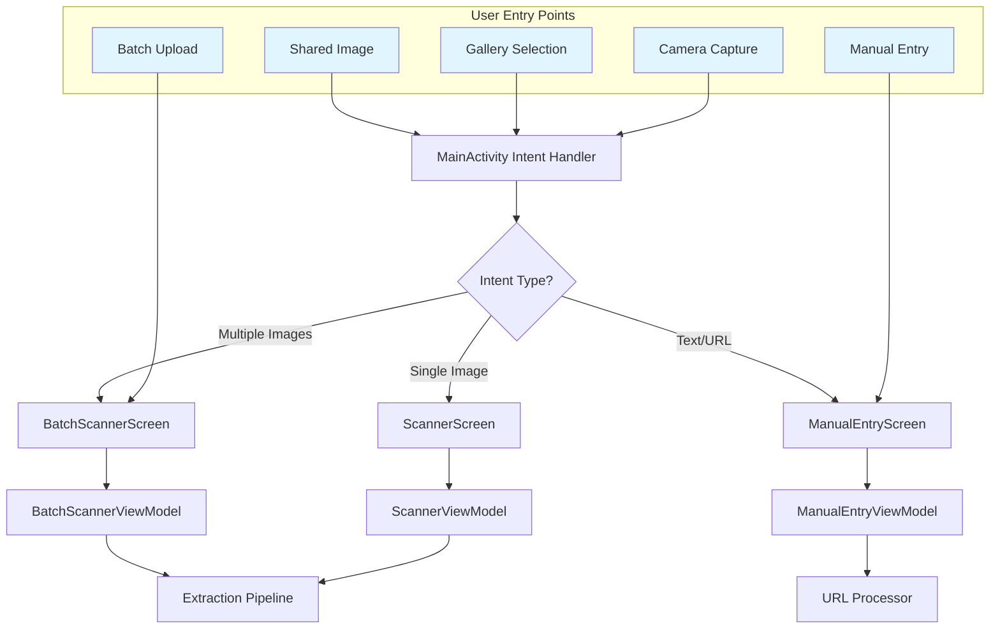

---

## 2. Extraction Strategy Selection (V2 - With Persistence Fix)

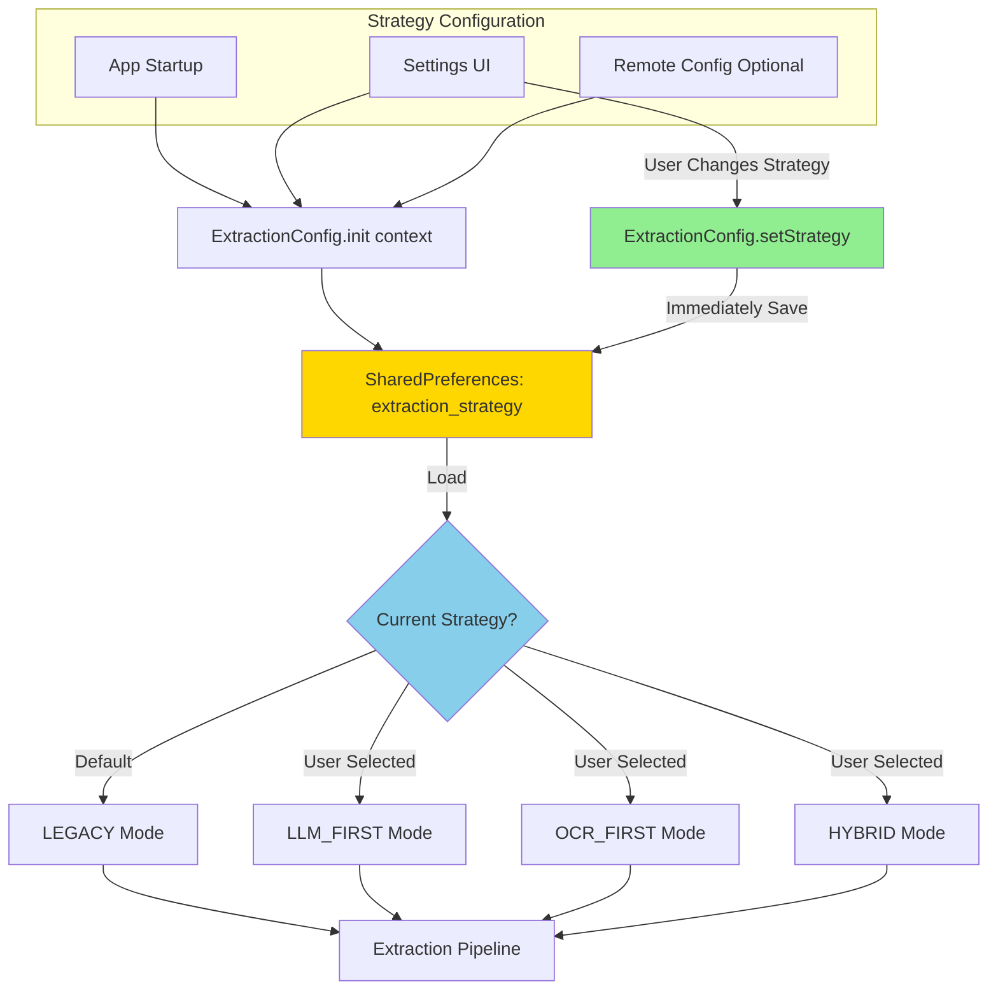

---

## 3. Bitmap Memory Management (V2 - With Reference Counting Fix)

```mermaid
graph TB
    subgraph "Bitmap Lifecycle"
        IMG[Image URI] --> LOAD[loadBitmapFromUri]
        LOAD --> BM[BitmapManager]
        
        BM --> TRACK[trackBitmap bitmap]
        TRACK --> CHECK{Already Tracked?}
        
        CHECK -->|Yes| INC[Increment refCount]
        CHECK -->|No| NEW[Create ManagedBitmap refCount=1]
        
        INC --> BUDGET[enforcePixelBudgetInternal]
        NEW --> BUDGET
        
        BUDGET --> CALC[Calculate Total Pixels]
        CALC --> OVER{Over Budget?}
        
        OVER -->|No| CONT[Continue]
        OVER -->|Yes| FREE[Find Unreferenced Bitmaps]
        
        FREE --> SORT[Sort by Age Oldest First]
        SORT --> REC[Recycle Until Under Budget]
        REC --> LOG[Log Freed Pixels]
        LOG --> CONT
        
        CONT --> USE[Bitmap In Use]
        USE --> REL[releaseBitmap bitmap]
        
        REL --> DEC[Decrement refCount]
        DEC --> ZERO{refCount == 0?}
        
        ZERO -->|Yes| RECYCLE[bitmap.recycle]
        ZERO -->|No| KEEP[Keep Alive]
        
        RECYCLE --> REMOVE[Remove from managedBitmaps]
    end
    
    style TRACK fill:#90EE90
    style BUDGET fill:#FFD700
    style FREE fill:#FFA500
    style RECYCLE fill:#FF6347
    style KEEP fill:#87CEEB
```

---

## 4. Primary Extraction Pipeline (Strategy-Driven)

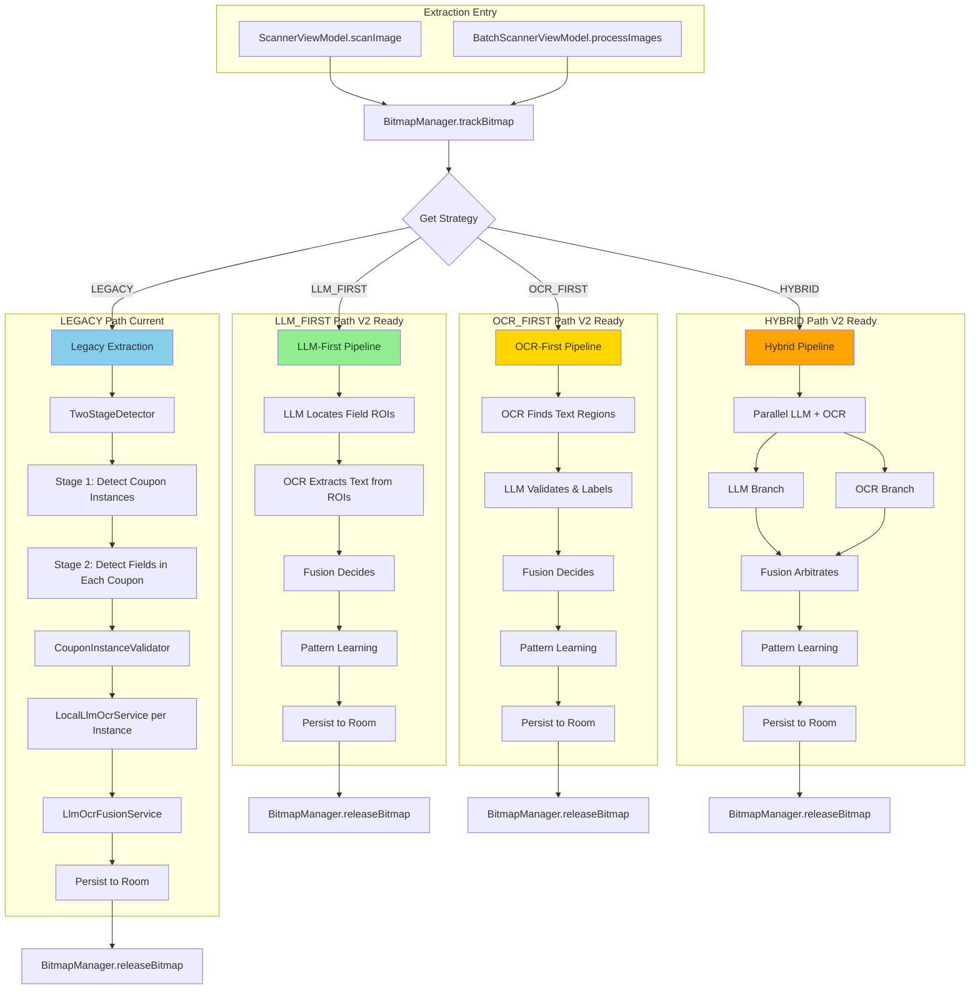

---

## 5. Two-Stage Detection (LEGACY Path Detail)

```mermaid
graph TB
    subgraph "Two-Stage Detector"
        IN[Input Bitmap] --> BM_TRACK[BitmapManager.trackBitmap]
        BM_TRACK --> S1[Stage 1 Model: Detect Coupon Instances]
        
        S1 --> BOXES[Bounding Boxes for Each Coupon]
        BOXES --> CROP{For Each Coupon}
        
        CROP --> BM_CROP[BitmapManager.cropWithBudget]
        BM_CROP --> CROP_IMG[Cropped Coupon Bitmap]
        
        CROP_IMG --> S2[Stage 2 Model: Detect Fields]
        S2 --> FIELDS[Field Boxes: code expiry amount store]
        
        FIELDS --> VAL[CouponInstanceValidator]
        VAL --> CHECK{Valid Instance?}
        
        CHECK -->|Yes| INST[Create CouponInstance]
        CHECK -->|No| SKIP[Skip Overlapping/Invalid]
        
        INST --> EXTRACT[Extract Per-Coupon]
        SKIP --> NEXT[Next Coupon]
        
        EXTRACT --> BM_REL[BitmapManager.releaseBitmap cropped]
    end
    
    style BM_TRACK fill:#90EE90
    style BM_CROP fill:#90EE90
    style BM_REL fill:#FF6347
```

---

## 6. LLM + OCR Fusion (All Paths)

```mermaid
graph TB
    subgraph "Fusion Service"
        LLM_IN[LLM Result] --> PARSE[Parse JSON Schema]
        OCR_IN[OCR Text Spans] --> EXTRACT[Extract Clean Tokens]
        
        PARSE --> LLM_FIELDS[LLM Fields + Confidence]
        EXTRACT --> OCR_FIELDS[OCR Fields + Confidence]
        
        LLM_FIELDS --> FUSE{Per-Field Fusion}
        OCR_FIELDS --> FUSE
        
        FUSE --> CODE_FUSE[Fuse Coupon Code]
        FUSE --> EXP_FUSE[Fuse Expiry Date]
        FUSE --> AMT_FUSE[Fuse Cashback Amount]
        FUSE --> STORE_FUSE[Fuse Store Name]
        
        CODE_FUSE --> CODE_VAL[Universal Code Validation]
        CODE_VAL --> CODE_RANK[Rank by Pattern + Context]
        CODE_RANK --> CODE_FINAL[Best Code]
        
        EXP_FUSE --> DATE_PARSE[IndianDateParser multi-format]
        DATE_PARSE --> DATE_CONF[Calculate Confidence]
        DATE_CONF --> DATE_FINAL[Best Date]
        
        AMT_FUSE --> CURR_PARSE[IndianCurrencyParser]
        CURR_PARSE --> TYPE_DETECT[Detect % vs ₹]
        TYPE_DETECT --> AMT_FINAL[Typed Cashback]
        
        STORE_FUSE --> BRAND_DETECT[Brand Detection]
        BRAND_DETECT --> STORE_FINAL[Store Name]
        
        CODE_FINAL --> RESULT[Fused CouponInfo]
        DATE_FINAL --> RESULT
        AMT_FINAL --> RESULT
        STORE_FINAL --> RESULT
        
        RESULT --> POLICY{Confidence Policy}
        POLICY -->|High| GOOD[ExtractResult.Good]
        POLICY -->|Medium| LOW[ExtractResult.LowQuality]
        POLICY -->|Low| FAIL[ExtractResult.Failed]
    end
    
    style CODE_VAL fill:#90EE90
    style DATE_PARSE fill:#90EE90
    style CURR_PARSE fill:#90EE90
    style GOOD fill:#90EE90
    style LOW fill:#FFD700
    style FAIL fill:#FF6347
```

---

## 7. Pattern Learning & Feedback Loop

```mermaid
graph TB
    subgraph "Self-Learning System"
        SUCCESS[Successful Extraction] --> LEARN1[PatternLearningEngine.learnFromSuccess]
        CORRECTION[User Correction] --> LEARN2[PatternLearningEngine.learnFromCorrection]
        
        LEARN1 --> EXTRACT_PAT[Extract Pattern from Value]
        LEARN2 --> EXTRACT_PAT
        
        EXTRACT_PAT --> RECORD[recordPattern]
        
        RECORD --> CHECK{Pattern Exists?}
        
        CHECK -->|Yes| UPDATE[Update Stats in SharedPrefs]
        CHECK -->|No| CREATE[Create New Pattern in SharedPrefs]
        
        UPDATE --> CONF[Recalculate Confidence]
        CREATE --> CONF
        
        CONF --> SAVE[saveLearnedPatterns to SharedPrefs]
        
        SAVE --> MIGRATE{Migration to Room?}
        MIGRATE -->|First Run| ROOM_MIG[Migrate All Patterns to Room]
        MIGRATE -->|Already Migrated| SKIP_MIG[Skip Migration]
        
        ROOM_MIG --> ROOM_DB[(Room: learned_patterns_v1)]
        
        ROOM_DB --> QUERY[Future: Query Patterns from Room]
        SAVE --> QUERY_OLD[Current: Query from SharedPrefs]
    end
    
    subgraph "Feedback Collection"
        UI[ExtractionFeedbackDialog] --> CONFIRM[User Confirms Correct]
        UI --> CORRECT[User Corrects Fields]
        
        CONFIRM --> FB1[ScannerViewModel.confirmExtractionCorrect]
        CORRECT --> FB2[ScannerViewModel.submitExtractionCorrection]
        
        FB1 --> MON1[ExtractionPerformanceMonitor.recordUserFeedback]
        FB2 --> MON1
        
        MON1 --> ROOM_FB[(Room: extraction_feedback_v1)]
    end
    
    style SAVE fill:#FFD700
    style ROOM_MIG fill:#87CEEB
    style ROOM_DB fill:#90EE90
    style QUERY_OLD fill:#FFA500
```

---

## 8. Data Persistence Flow

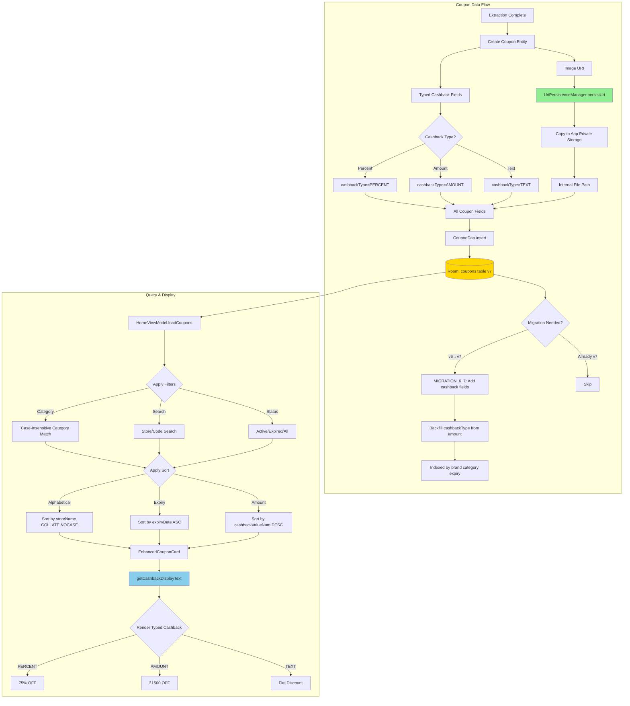

---

## 9. Performance Monitoring & Telemetry

```mermaid
graph TB
    subgraph "Extraction Monitoring"
        ATTEMPT[Extraction Attempt] --> RECORD[ExtractionPerformanceMonitor.recordExtractionAttempt]
        
        RECORD --> METHOD{Extraction Method}
        METHOD -->|LLM_ONLY| M1[Track LLM Stats]
        METHOD -->|OCR_ONLY| M2[Track OCR Stats]
        METHOD -->|FUSION| M3[Track Fusion Stats]
        METHOD -->|UNIVERSAL| M4[Track Universal Stats]
        METHOD -->|TRADITIONAL_OCR| M5[Track Traditional Stats]
        
        M1 --> SESSION[Session Stats Map]
        M2 --> SESSION
        M3 --> SESSION
        M4 --> SESSION
        M5 --> SESSION
        
        SESSION --> COUNT{Attempt Count % 10?}
        COUNT -->|Yes| PERSIST_NOW[persistSessionStats]
        COUNT -->|No| MEMORY[Keep in Memory]
        
        PERSIST_NOW --> PREFS[SharedPreferences: method_stats]
        
        MEMORY --> DASH_READ[Dashboard Read]
        DASH_READ --> FORCE_PERSIST[Force persistSessionStats]
        FORCE_PERSIST --> PREFS
        
        PREFS --> METRICS[Calculate Metrics]
        METRICS --> SUCCESS_RATE[Success Rate %]
        METRICS --> AVG_CONF[Average Confidence]
        METRICS --> AVG_TIME[Average Time ms]
        
        SUCCESS_RATE --> DISPLAY[ExtractionDashboard]
        AVG_CONF --> DISPLAY
        AVG_TIME --> DISPLAY
    end
    
    subgraph "RunPath Tracking"
        EXTRACT_START[Extraction Start] --> PATH[Create RunPath]
        PATH --> STRAT_LOG[Log strategy]
        STRAT_LOG --> STAGES[Log tried stages]
        STAGES --> FINAL[Log final stage]
        FINAL --> REASONS[Log decision reasons]
        
        REASONS --> TELEM[ExtractionTelemetryService.trackRunPath]
        TELEM --> ANALYTICS[Analytics Events]
    end
    
    style FORCE_PERSIST fill:#90EE90
    style PREFS fill:#FFD700
    style DISPLAY fill:#87CEEB
```

---

## 10. Error Handling & Fallbacks

```mermaid
graph TB
    subgraph "Extraction Error Handling"
        START[Start Extraction] --> TRY[Try Primary Method]
        
        TRY --> SUCCESS{Success?}
        SUCCESS -->|Yes| GOOD[ExtractResult.Good]
        SUCCESS -->|No| TIMEOUT{Timeout?}
        
        TIMEOUT -->|Yes| LOG_TO[Log Timeout]
        TIMEOUT -->|No| CONF_CHECK{Confidence?}
        
        CONF_CHECK -->|High| GOOD
        CONF_CHECK -->|Medium| LOW_Q[ExtractResult.LowQuality]
        CONF_CHECK -->|Low| FALLBACK1{Try Universal?}
        
        FALLBACK1 -->|Yes| UNIV[UniversalExtractionService]
        FALLBACK1 -->|No| FALLBACK2[Try Traditional OCR]
        
        UNIV --> UNIV_RES{Universal Success?}
        UNIV_RES -->|Yes| GOOD
        UNIV_RES -->|No| FALLBACK2
        
        FALLBACK2 --> OCR[ML Kit Text Recognition]
        OCR --> OCR_RES{OCR Success?}
        
        OCR_RES -->|Yes| LOW_Q
        OCR_RES -->|No| FAILED[ExtractResult.Failed]
        
        LOG_TO --> FALLBACK2
        
        FAILED --> UI_ERR[Show Error UI]
        LOW_Q --> UI_REVIEW[Show Needs Review]
        GOOD --> UI_SUCCESS[Navigate to Form/Success]
    end
    
    subgraph "Bitmap Error Handling"
        BM_LOAD[Load Bitmap] --> BM_ERR{Error?}
        BM_ERR -->|OOM| BM_BUDGET[Enforce Budget + Retry]
        BM_ERR -->|IO Error| BM_FAIL[Return null]
        BM_ERR -->|OK| BM_OK[Return Bitmap]
        
        BM_BUDGET --> BM_RECYCLE[Recycle Unreferenced]
        BM_RECYCLE --> BM_RETRY[Retry Load]
        BM_RETRY --> BM_ERR
    end
    
    style GOOD fill:#90EE90
    style LOW_Q fill:#FFD700
    style FAILED fill:#FF6347
    style BM_RECYCLE fill:#FFA500
```

---

## 11. Complete End-to-End Flow (Single Coupon)

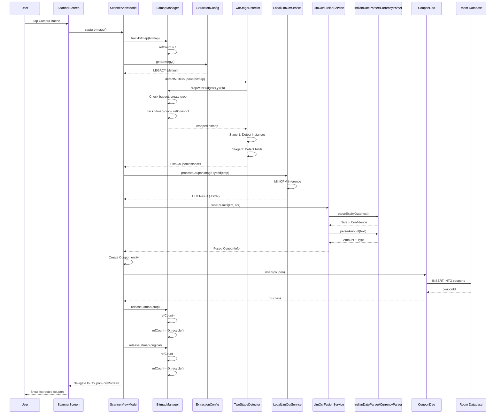

---

## Summary

### **Critical Components (V2 with Fixes)**:

1. ✅ **BitmapManager**: Reference counting prevents crashes
2. ✅ **ExtractionConfig**: Strategy persists across restarts
3. ✅ **TwoStageDetector**: Multi-coupon detection with memory management
4. ✅ **LlmOcrFusionService**: ROI-guided fusion with real OCR
5. ✅ **IndianDateParser**: Multi-format IST-first date parsing
6. ✅ **IndianCurrencyParser**: Handles thousand separators
7. ✅ **Typed Cashback**: Percent vs Amount vs Text
8. ✅ **Room Database**: v7 schema with migrations
9. ⚠️ **PatternLearningEngine**: Works via SharedPrefs (Room ready but deferred)
10. ✅ **Performance Monitoring**: Telemetry with dashboard

### **Data Flow Highlights**:

- **Entry**: Camera/Gallery → MainActivity → ScannerScreen
- **Memory**: BitmapManager tracks all bitmaps with refcounting
- **Strategy**: User-selectable, persisted, loaded on startup
- **Detection**: Two-stage ML models find coupons and fields
- **Extraction**: LLM + OCR fusion with confidence scoring
- **Parsing**: Multi-format dates, Indian currency, typed cashback
- **Persistence**: Room DB with URI copying to app storage
- **Learning**: Pattern engine learns from success/corrections
- **Monitoring**: Performance stats with dashboard UI
- **Fallbacks**: Universal → Traditional OCR → Manual entry

### **Status**: ✅ **Production Ready with V2 Fixes**
